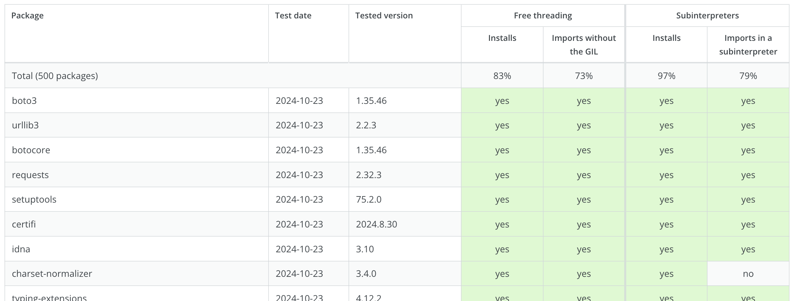

# Package compatibility tracker: Python 3.13 free-threading and subinterpreters
## https://parallel.python.tips



This project uses Python, Prefect, and Docker to automatically test
**very basic compatibility** of popular Python packages with
Python 3.13's free-threading build and subinterpreters in the standard build.

Two tests are run for each package:
* Install the package in a fresh Docker container with the **free-threading Python build**. Import the package and check that **the GIL remains disabled** (i.e. the package doesn't declare that it requires the GIL).
* Install the package in a fresh Docker container with the standard Python build. Start a **subinterpreter** and check that the package **can be imported there** (i.e. the package doesn't forbid importing outside of the main interpreter).

> [!NOTE]
> These are simple tests that do not exercise most of the package code, and so cannot truly guarantee compatibility. In particular, since we are dealing with thread safety, many issues are likely to be found only by complex, multi-threaded tests. See [py-free-threading.github.io](https://py-free-threading.github.io/tracking/) for a shorter list of packages that have been tested more thoroughly.

It is also important to realise that the free-threading build is very new and experimental
(<a href="https://docs.python.org/3/howto/free-threading-python.html">see the docs</a>),
and that subinterpreters are not even officially supported yet
(watch <a href="https://peps.python.org/pep-0734/">PEP 734</a> for updates).
None of the package maintainers are obliged to support these experimental features.
In some cases this may require substantial changes to the package,
or even to major upstream dependencies such as Cython or PyO3. Please be patient and understanding
&ndash; maintaining packages and adapting to major changes in Python is a lot of work.

## Contributions welcome
If you found an error in the table (such as a false positive or false negative),
would like to add a package, or have any other feedback, please
<a href="https://github.com/vitawasalreadytaken/parallel-python-tracker/issues">open an issue</a> or submit a PR! 🙏

## How it works
1. Two Docker images are built (`make build`), one with standard Python 3.13 (for testing subinterpreters) and one with the experimental free-threading build of Python 3.13. These images contain simple test scripts that install and import a given package, and report the results in JSON on stdout. See the [test_runner/](./test_runner/) directory for the dockerfiles and test scripts.
    * There is a basic mechanism for adding extra test code for specific packages: modules in [test_runner/specific_tests/](./test_runner/specific_tests/) are automatically imported based on the package name and test type.
2. A simple Prefect-orchestrated script (`uv run` [workflow.py](./workflow.py)) runs through a list of packages to test and starts two docker containers for each, one for the subinterpreters test and one for free-threading. It collects the JSON-encoded test results from stdout and uses a Jinja2 [template](./templates/index.html) to generate the HTML table you can see at https://parallel.python.tips.
    * The list of packages to test is in [test_runner/tested_packages.toml](./test_runner/tested_packages.toml) and is sourced from https://github.com/hugovk/top-pypi-packages.

If you're not familiar with Prefect, you might need to run:

```
prefect config set PREFECT_API_URL=http://127.0.0.1:4200/api
uv run prefect server start
```

And then run the workflow with:

```
uv run workflow.py
```
